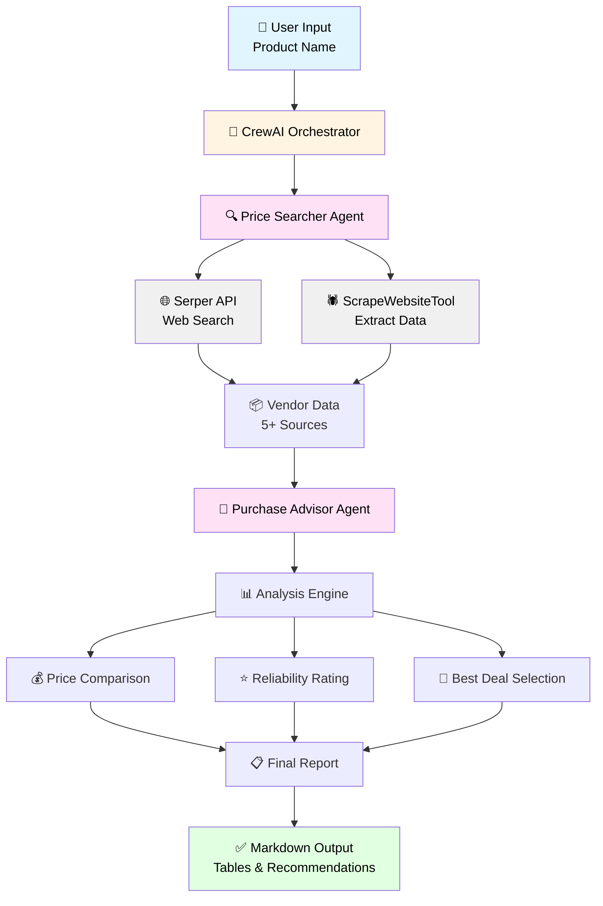

# 🛒 PriceHunter-AI

<div align="center">


**An intelligent AI-powered shopping assistant that finds the best deals across the web**

[Features](#-features) • [Installation](#-installation) • [Usage](#-usage) 
</div>

---

## 📖 Overview

PriceHunter-AI is a multi-agent AI system built with CrewAI that autonomously searches the web for products, compares prices from multiple vendors, and generates comprehensive shopping reports with actionable recommendations. Never overpay again!

### 🎯 How It Works

PriceHunter-AI deploys a team of specialized AI agents:

1. **🔍 Price Searcher Agent**: Scours the web to find at least 5 vendors selling your desired product, extracting prices and direct links
2. **💼 Purchase Advisor Agent**: Analyzes findings and generates a detailed comparison report with smart recommendations

### 🏛️ System Architecture



**Flow Overview:**
1. User specifies product → CrewAI initializes agent workflow
2. Price Searcher Agent searches web and scrapes vendor sites
3. Collected data passes to Purchase Advisor Agent
4. Advisor analyzes prices, rates reliability, identifies best deals
5. System generates formatted report with recommendations

## ✨ Features

- 🤖 **Autonomous Multi-Agent System**: Powered by CrewAI for intelligent task coordination
- 🌐 **Web Search Integration**: Uses Serper API for comprehensive product searches
- 📊 **Beautiful Markdown Reports**: Generates structured comparison tables with:
  - Price comparisons from 5+ vendors
  - Reliability ratings (⭐⭐⭐⭐⭐)
  - Direct purchase links
  - Potential savings calculations
  - Smart recommendations
- 🎯 **Smart Recommendations**: AI-powered analysis to find the best value
- 🔗 **Web Scraping**: Extracts accurate pricing information from vendor websites
- 📝 **Jupyter Notebook Interface**: Easy-to-use interactive environment

## 🚀 Installation

### Prerequisites

- Python 3.10 or higher
- OpenAI API key
- Serper API key (for web searches)

### Setup

1. **Clone the repository**
```bash
git clone https://github.com/iitsh/PriceHunter-AI.git
cd PriceHunter-AI
```

2. **Install dependencies**
```bash
pip install -r requirements.txt
```

3. **Configure environment variables**

Create a `.env` file in the project root:
```env
OPENAI_API_KEY=your_openai_api_key_here
SERPER_API_KEY=your_serper_api_key_here
```

> 💡 **Get your API keys:**
> - OpenAI: https://platform.openai.com/api-keys
> - Serper: https://serper.dev/api-key

## 📚 Usage

### Using Jupyter Notebook

1. **Launch Jupyter Notebook**
```bash
jupyter notebook
```

2. **Open `smart_shopper_swarm.ipynb`**

3. **Modify the product search**
```python
# ✏️ MODIFY HERE
produit = "iphone 15"  # Change to your desired product
```

4. **Run all cells** to start the price hunt!

### Example Output

The system generates a comprehensive report like this:

```markdown
## 🏆 Recommandation
**Vendeur:** Back Market  
**Prix:** 650 EUR  
**Lien:** https://www.backmarket.com/...

## 📊 Comparatif des Prix
| Vendeur | Prix | Fiabilité | Lien |
|---------|------|-----------|------|
| Back Market | 650 EUR | ⭐⭐⭐⭐ | [Link] |
| Amazon | 720 EUR | ⭐⭐⭐⭐ | [Link] |
| ... | ... | ... | ... |

## 💰 Économies
- Prix min: 365 EUR
- Prix max: 830 EUR
- Économie: 465 EUR

## 💡 Conclusion
[Smart AI-generated recommendation]
```

## 🏗️ Project Structure

```
PriceHunter-AI/
│
├── smart_shopper_swarm.ipynb  # Main notebook interface
├── utils.py                    # Utility functions for API keys
├── .env                        # Environment variables (create this)
├── requirements.txt            # Python dependencies
└── README.md                   # This file
```

## 🛠️ Technologies Used

- **[CrewAI](https://github.com/joaomdmoura/crewAI)**: Multi-agent orchestration framework
- **[OpenAI GPT](https://openai.com)**: Large language model for intelligent agents
- **[Serper API](https://serper.dev)**: Web search API
- **[Python](https://python.org)**: Core programming language
- **Jupyter Notebook**: Interactive development environment

## 🎨 Features Breakdown

### Agent Architecture

#### 🔍 Price Searcher Agent
- **Role**: Find vendors with competitive pricing
- **Goal**: Locate at least 5 vendors with prices and direct links
- **Tools**: SerperDevTool, ScrapeWebsiteTool

#### 💼 Purchase Advisor Agent
- **Role**: Analyze and recommend best deals
- **Goal**: Create structured comparison reports
- **Output**: Markdown-formatted reports with tables and recommendations

### Report Components

1. **🏆 Recommendation Section**: Best deal highlighted
2. **📊 Price Comparison Table**: Side-by-side vendor comparison
3. **💰 Savings Calculator**: Min/max prices and potential savings
4. **💡 Conclusion**: AI-generated purchasing advice

## 📋 Requirements

Create a `requirements.txt` file with:

```txt
crewai>=0.1.0
crewai-tools>=0.1.0
python-dotenv>=1.0.0
openai>=1.0.0
jupyter>=1.0.0
notebook>=7.0.0
```

## 🤝 Contributing

Contributions are welcome! Here's how you can help:

1. Fork the repository
2. Create a feature branch (`git checkout -b feature/AmazingFeature`)
3. Commit your changes (`git commit -m 'Add some AmazingFeature'`)
4. Push to the branch (`git push origin feature/AmazingFeature`)
5. Open a Pull Request

### Ideas for Contributions

- 🌍 Add support for more countries/currencies
- 📱 Create a web interface
- 📧 Email notifications for price drops
- 📈 Price history tracking
- 🔔 Set up price alerts
- 🎨 Enhanced visualization

## 🐛 Troubleshooting

**Issue: API Key Errors**
- Ensure your `.env` file is in the project root
- Verify both API keys are valid and active

**Issue: No Results Found**
- Try broader search terms
- Check your internet connection
- Verify Serper API quota isn't exhausted

**Issue: Import Errors**
- Run `pip install -r requirements.txt` again
- Ensure you're using Python 3.10+

## 🙏 Acknowledgments

- [CrewAI](https://github.com/joaomdmoura/crewAI) for the amazing multi-agent framework
- [Serper](https://serper.dev) for web search capabilities
- OpenAI for GPT models

---

<div align="center">

**⭐ Star this repo if you find it helpful!**

Made with ❤️ by [iitsh](https://github.com/iitsh)

</div>
